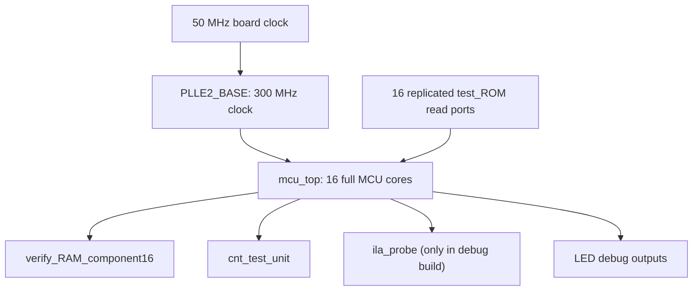
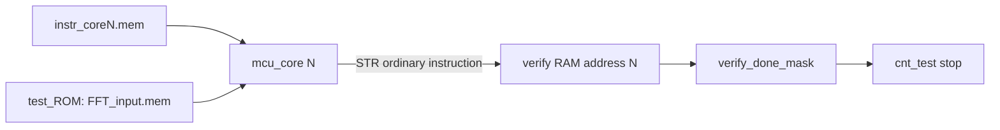

# V61 代码解析与架构设计报告

本文用于帮助小组成员从代码层面完全理解 `V61_testrom_addr_stable_300`：它为什么能完成 FFT、为什么符合“普通 MCU 指令”要求、速度怎么来的、计数为什么可信，以及验收时应该看哪些代码和证据。

## 1. 一句话总览

V61 不是一个 FFT 专用硬件加速器，而是一个 **16 个完整 MCU core 并行执行普通 32-bit ARM-like 指令** 的系统。每个 core 只负责 8 点复数 FFT 的一个输出分量：

- Core0 到 Core7 分别计算 `real(X0)` 到 `real(X7)`。
- Core8 到 Core15 分别计算 `imag(X0)` 到 `imag(X7)`。
- 每个 core 最后用普通 `STR` 指令写入一个 verify 地址。
- 全部 16 个 verify 地址写完后，系统停表，`cnt_test=38`。

当前 V61 已完成：

| 项目 | 结果 |
| --- | --- |
| 官方样例 + 20 随机 | PASS |
| `cnt_test` | 38 |
| 300 MHz no-ILA WNS/TNS | +0.162 ns / 0.000 ns |
| no-ILA LUT/FF/DSP/BRAM | 16712 / 13140 / 0 / 0 |
| no-ILA 上板 | PASS |
| ILA fast-stop 证明 | PASS |
| 最终板上状态 | 已恢复 no-ILA |

## 2. 先读哪些文件

建议按这个顺序读：

| 目的 | 文件 |
| --- | --- |
| 板级顶层、PLL、test ROM、verify RAM、ILA | `rtl/board_top.v` |
| 16 核并行系统、停表逻辑 | `rtl/mcu_top.v` |
| 单个 MCU core 的流水、指令执行、访存 | `rtl/mcu_core.v` |
| 指令 opcode 和地址空间定义 | `rtl/defines.vh` |
| test ROM 读接口 | `rtl/ext_test_rom_if.v` |
| verify RAM 写接口 | `rtl/verify_ram_if.v` |
| 计数器 | `rtl/cnt_test.v` |
| 16 个 core 的汇编生成器 | `scripts/gen_fft8_component_asm.py` |
| 汇编转机器码 | `scripts/assembler.py` |
| 机器码 | `mem/instr_core*.mem` |
| 反汇编证据 | `results/core*_disasm.txt` |
| 指令统计 | `results/opcode_summary_all.csv` |
| 上板证明 | `board_validation/BOARD_VALIDATION_REPORT.md` |

## 3. 顶层架构

V61 的硬件结构可以理解为下面这张图：



板级顶层在 `rtl/board_top.v`：

- `clk_ultra_pll` 把板载 50 MHz 时钟变成 300 MHz。
- `g_test_rom` 生成 16 个 test ROM 读口，每个 core 一个读口。
- `mcu_top` 实例化真正的 16 核 MCU 系统。
- `verify_RAM_component16` 保存 16 个 verify 输出，供 debug 查看。
- `ila_probe` 只在 `ENABLE_ILA` 时用于抓波形，正式 no-ILA 版本不包含 ILA。

关键代码位置：

- `rtl/board_top.v:36`：PLL 实例。
- `rtl/board_top.v:68`：16 个 test ROM 读口。
- `rtl/board_top.v:77`：`mcu_top` 实例。
- `rtl/board_top.v:98`：16 分量 verify RAM。
- `rtl/board_top.v:107`：ILA probe。
- `rtl/board_top.v:126` 到 `rtl/board_top.v:133`：LED 调试输出。

## 4. 16 核 component-owner 思路

V61 的核心优化叫 component-owner。意思是：每个 core 拥有一个输出分量，不需要多个 core 合并 partial sum。

| Core | 负责输出 | verify 地址 |
| ---: | --- | ---: |
| 0 | `real(X0)` | 0 |
| 1 | `real(X1)` | 1 |
| 2 | `real(X2)` | 2 |
| 3 | `real(X3)` | 3 |
| 4 | `real(X4)` | 4 |
| 5 | `real(X5)` | 5 |
| 6 | `real(X6)` | 6 |
| 7 | `real(X7)` | 7 |
| 8 | `imag(X0)` | 8 |
| 9 | `imag(X1)` | 9 |
| 10 | `imag(X2)` | 10 |
| 11 | `imag(X3)` | 11 |
| 12 | `imag(X4)` | 12 |
| 13 | `imag(X5)` | 13 |
| 14 | `imag(X6)` | 14 |
| 15 | `imag(X7)` | 15 |

这个分工在 `scripts/gen_fft8_component_asm.py` 中生成：

- `core_id < 8` 时生成 real 分量程序。
- `core_id >= 8` 时生成 imag 分量程序。
- `verify_addr = core_id`，所以每个 core 只写自己的 verify 地址。

对应代码：

- `scripts/gen_fft8_component_asm.py:72`：生成单个 component-owner core。
- `scripts/gen_fft8_component_asm.py:73` 到 `80`：core 到 real/imag 输出和 verify 地址的映射。
- `scripts/gen_fft8_component_asm.py:124`：最后生成 `STR R12, [R5 + verify_addr]`。

## 5. FFT 是怎么由普通指令算出来的

### 5.1 输入数据格式

`mem/FFT_input.coe` 前 144 个 16-bit word 分成三段：

| 范围 | 含义 |
| --- | --- |
| `0..63` | DFT/FFT 实部矩阵 `wr[n,k]` |
| `64..127` | DFT/FFT 虚部矩阵 `wi[n,k]` |
| `128..135` | 输入实部 `xr[n]` |
| `136..143` | 输入虚部 `xi[n]` |

参考模型在 `scripts/official_fft_model.py` 中按下面公式计算：

```text
real(Xk) = sum_n (xr[n] * wr[n,k] - xi[n] * wi[n,k])
imag(Xk) = sum_n (xr[n] * wi[n,k] + xi[n] * wr[n,k])
```

代码位置：

- `scripts/official_fft_model.py` 中 `expected_from_fft_input` 函数。

### 5.2 为什么程序只有 33 或 37 条指令

8 点 FFT 的系数有对称性。V61 把 `n=p` 和 `n=p+4` 两项配成一对，只处理 4 对：

```text
(0,4), (1,5), (2,6), (3,7)
```

每对先读取：

```text
xr[p], xi[p], xr[p+4], xi[p+4]
```

然后根据系数关系做 `ADD` 或 `SUB`，得到这对的合并输入。这个判断在：

- `scripts/gen_fft8_component_asm.py:50`：`pair_sign`
- `scripts/gen_fft8_component_asm.py:96` 到 `112`：四组 pair 的指令生成

系数只需要处理这几种：`0`、`128`、`-128`、`91`、`-91`。其中 `128` 和 `-128` 可以用加减完成，`±91` 会先放进 `R14` bucket，最后只用一次普通 `MUL` 乘以 91。

代码位置：

- `scripts/gen_fft8_component_asm.py:32`：`emit_component_term`
- `scripts/gen_fft8_component_asm.py:117`：`Fold +/-91 bucket with one ordinary MUL instruction.`

### 5.3 Core0 示例：计算 `real(X0)`

Core0 的汇编在 `asm/fft8_core00_real_x0.asm`。它没有 `MUL`，因为 `X0` 的实部系数全是简单加法。

它的核心模式是：

```asm
LDR R8, [R7 + 128]
LDR R9, [R7 + 136]
LDR R10, [R7 + 132]
LDR R11, [R7 + 140]
ADD R8, R8, R10
ADD R9, R9, R11
ADD R12, R12, R8
```

最后：

```asm
STR R12, [R5 + 0]
HALT
```

这说明 Core0 读取 test ROM，做普通加法，最后用普通 `STR` 写 verify 地址 0。

### 5.4 Core1 示例：计算 `real(X1)`

Core1 的汇编在 `asm/fft8_core01_real_x1.asm`。它需要处理 `±91` 系数，所以有一次普通 `MUL`：

```asm
MUL R14, R14, R6
ADD R12, R12, R14
STR R12, [R5 + 1]
HALT
```

其中：

- `R5 = VERIFY_BASE`
- `R7 = TEST_BASE`
- `R6 = 91`
- `R12` 是最终输出累加器
- `R14` 是 `±91` 项的临时 bucket

机器码证据在 `mem/instr_core1.mem`，反汇编证据在 `results/core1_disasm.txt`。

## 6. 为什么这是 MCU，不是专用 FFT 硬件

### 6.1 指令集是普通 32-bit 指令

opcode 定义在 `rtl/defines.vh`：

```verilog
OP_ADD, OP_SUB, OP_AND, OP_OR, OP_MOVI, OP_MOVR,
OP_LDR, OP_STR, OP_B, OP_BL, OP_CMP, OP_BEQ,
OP_BNE, OP_MUL, OP_HALT
```

没有：

```text
BFY / FFT_STAGE / BUTTERFLY / CMUL / CADD / CSUB
```

机器码格式由 `scripts/assembler.py` 生成：

```text
[31:28] opcode
[27:24] rd
[23:20] rs1
[19:16] rs2
[15:0]  imm16
```

例如 Core1 的第一条机器码：

```text
55002000
```

对应：

```asm
MOVI R5, #VERIFY_BASE
```

可以这样证明：

- 机器码：`mem/instr_core1.mem`
- 反汇编：`results/core1_disasm.txt`
- opcode 统计：`results/opcode_summary_all.csv`

### 6.2 单个 core 有完整 MCU 结构

每个 `mcu_core` 都包含：

- PC / `instr_addr`
- instruction fetch / `instr_id`
- decoder
- control unit
- register file
- ALU
- load/store
- writeback
- branch
- halt / done
- 普通 `MUL` 执行单元

关键代码位置：

- `rtl/mcu_core.v:3`：`mcu_core` 模块。
- `rtl/mcu_core.v:125`：decoder。
- `rtl/mcu_core.v:135`：control unit。
- `rtl/mcu_core.v:146`：register file。
- `rtl/mcu_core.v:205`：ALU 快速路径。
- `rtl/mcu_core.v:218`：branch 判断。
- `rtl/mcu_core.v:263` 到 `286`：普通 `MUL` 的多周期执行。

### 6.3 `MUL` 是普通 Q7 乘法，不是蝶形单元

`mcu_core.v` 中的 `MUL` 做的是通用乘法：

- 取 `ex_op1` 的绝对值。
- 取 `ex_op2[7:0]` 的绝对值。
- 每拍处理 4 bit multiplier。
- 最后按 Q7 右移 7 位。

它不知道 FFT，也不知道 complex multiply。所有“复数公式”都是汇编生成器拆成普通指令后执行的。

## 7. 地址空间和数据流

地址空间由 `rtl/defines.vh` 定义：

| 地址高字节 | 含义 |
| --- | --- |
| `0x10xx` | test ROM |
| `0x20xx` | verify RAM |
| 其他 | data RAM |

在 `mcu_core.v` 中：

- `ex_op1[15:8] == 8'h10` 判定为 test ROM。
- `ex_op1[15:8] == 8'h20` 判定为 verify RAM。

关键代码：

- `rtl/mcu_core.v:172`：根据地址判断 memory region。
- `rtl/mcu_core.v:184`：连接 test ROM 接口。
- `rtl/mcu_core.v:194`：连接 verify RAM 接口。

数据流是：



## 8. V61 的 WNS 优化到底改了什么

V61 相比 V60 的功能结构不变，只改了 test ROM 地址路径。

V60 原写法相当于：

```verilog
assign test_rom_addr = is_test_rom ? test_offset : 8'd0;
```

V61 改为：

```verilog
assign test_rom_addr = test_offset;
```

代码在 `rtl/ext_test_rom_if.v:15`。

为什么安全：

- 真正写回寄存器的数据仍在 `mcu_core.v` 中由 `ex_is_test_rom` 选择。
- 非 test-ROM 读不会把 test ROM 数据写进寄存器。
- `first_read_pulse` 仍然有 `mem_read && is_test_rom` 门控。

这只是去掉 test ROM 地址端口上不必要的控制路径，不是新硬件，也不改变计数口径。

结果：

| 项目 | V60 | V61 |
| --- | ---: | ---: |
| `cnt_test` | 38 | 38 |
| no-ILA WNS | +0.014 ns | +0.162 ns |
| LUT | 16970 | 16712 |
| FF | 13203 | 13140 |
| DSP | 0 | 0 |

## 9. 停表和 `cnt_test` 为什么可信

计数器在 `rtl/cnt_test.v`：

- 首次读取 FFT 输入时开始计数。
- 所有 16 个 verify 地址都可信写入后停止。

开始信号：

```verilog
start_pulse = |first_test_rom_read_i
```

停止信号：

```verilog
stop_pulse = verify_complete_q
```

`verify_complete_q` 来自 `mcu_top.v` 中的 16 位 done mask：

```verilog
done_mask_next = done_mask_q | verify_hit_mask
verify_complete_next = (done_mask_next == 16'hffff)
```

关键代码位置：

- `rtl/mcu_top.v:88` 到 `108`：每个 verify 地址的命中判断。
- `rtl/mcu_top.v:110` 到 `111`：16 位写回完成 mask。
- `rtl/mcu_top.v:113`：计数器实例。
- `rtl/mcu_top.v:144` 到 `145`：ILA 证明用的 `verify_done_mask_next_dbg` 和 `fast_stop_pulse_dbg`。

上板 ILA 证明显示：

```text
write_count=16
unique_addr_count=16
last_write_addr=15
last_write_sample=31
last_write_cnt_test=36
first_fast_stop_sample=32
first_fast_stop_cnt_test=37
first_done_sample=33
first_done_cnt_test=38
verify_done_mask_q_at_first_fast_stop=0xffff
verify_done_mask_next_at_first_fast_stop=0xffff
fast_stop_not_early=PASS
overall_status=PASS
```

解释：

- sample 31：最后一批 verify 写回完成，包含 addr15。
- sample 32：fast-stop 触发，此时 done mask 已经是 `0xffff`。
- sample 33：系统 `done=1` 稳定，`cnt_test=38`。

所以 V61 不是提前停表。

## 10. 验证链路

### 10.1 仿真回归

`results/regression_summary.txt`：

- 官方样例 PASS。
- 20 组随机 PASS。
- 每组 `cnt_test=38`。

### 10.2 基础指令集测试

基础指令测试使用：

```powershell
iverilog -g2005 -I rtl -I tb -o build\tb_standard_instruction.vvp tb\tb_standard_instruction.v rtl\mcu_core.v rtl\instr_rom.v rtl\data_ram.v rtl\ext_test_rom_if.v rtl\verify_ram_if.v rtl\decoder.v rtl\control_unit.v rtl\reg_file.v rtl\alu.v
vvp build\tb_standard_instruction.vvp +INSTR_MEM=mem\instr_standard.mem
```

结果：

```text
STANDARD_INSTRUCTION_TEST PASS cycles=31
```

这证明单个 MCU core 的基础指令路径能跑通。

### 10.3 合规扫描

`results/forbidden_module_scan.txt`：

```text
PASS: no forbidden FFT/DFT/DMA/coprocessor modules found in rtl/*.v
```

`results/forbidden_opcode_scan.txt`：

```text
PASS: no forbidden BFY/FFT_STAGE/BUTTERFLY/CMUL/CADD/CSUB opcodes found
```

### 10.4 Vivado 和上板

正式 no-ILA：

- WNS/TNS = `+0.162 ns / 0.000 ns`
- LUT/FF/DSP/BRAM = `16712 / 13140 / 0 / 0`
- DRC 0
- Methodology 0

ILA 证明版：

- WNS/TNS = `+0.008 ns / 0.000 ns`
- LUT/FF/DSP/BRAM = `18899 / 17070 / 0 / 12`
- 只用于证明，不用于正式资源和速度计分。

上板报告：

- `board_validation/BOARD_VALIDATION_REPORT.md`
- `board_validation/v61_hw_compare_status.txt`
- `board_validation/v61_fast_stop_proof.csv`
- `board_validation/v61_hw_compare.csv`

## 11. 老师可能问的问题和回答

### 问：你们是不是写了 FFT 专用硬件？

答：没有。FFT 计算由 16 个完整 MCU core 执行普通指令完成。可以看 `rtl/mcu_core.v`，每个 core 都有 decoder、control unit、寄存器堆、ALU、load/store、writeback 和 halt。禁用模块扫描也显示没有 FFT/DFT/DMA/coprocessor 模块。

### 问：机器码在哪里？

答：机器码在 `mem/instr_core0.mem` 到 `mem/instr_core15.mem`。每行是 32-bit 指令。对应反汇编在 `results/core0_disasm.txt` 到 `results/core15_disasm.txt`。

### 问：架构位宽怎么看？

答：指令是 32-bit，`instr_rom` 输出 `wire [31:0] instr`。`mcu_core` 中 `instr_id`、`ex_imm32`、`wb_wdata` 等都是 32-bit。寄存器堆和 ALU 数据路径也是 signed 32-bit。

### 问：verify 是不是硬件直接写的？

答：不是。verify 写入来自普通 `STR` 指令。每个 core 最后一条计算后执行 `STR R12, [R5 + verify_addr]`。`verify_ram_if.v` 只是把 MCU 的普通 store 地址和数据转换成 verify RAM 写使能。

### 问：为什么有 16 个 test ROM，不是作弊吗？

答：16 个 test ROM 是输入读口复制，让 16 个 MCU core 可以并行取同一份测试数据。它们只存储输入数据，不做计算。计算仍发生在每个 MCU core 的普通指令里。

### 问：你们是不是只针对官方数据硬编码答案？

答：不是。程序没有写死输出答案，而是用 `LDR` 从 test ROM 读取输入样本，再用普通指令计算。20 组随机输入也全部 PASS。需要注意的是，汇编生成器默认使用测试文件中的 DFT/FFT 系数矩阵作为常量结构；如果老师更换的是输入样本而矩阵特性不变，程序可直接适配。如果矩阵也更换，应重新运行生成器生成 16 个 core 的程序。

### 问：为什么 `cnt_test=38` 可信？

答：ILA 捕获显示 16 个 verify 地址全部写完后才 fast-stop。`verify_done_mask_q` 和 `verify_done_mask_next` 在 fast-stop 当拍都是 `0xffff`，输出比对 PASS，`fast_stop_not_early=PASS`。

### 问：V61 比 V60 改了什么？

答：只改了 test ROM 地址路径，去掉 `is_test_rom` 对 `test_rom_addr` 的门控，使 WNS 更稳。V60 no-ILA WNS 是 `+0.014 ns`，V61 提高到 `+0.162 ns`。速度仍然是 `cnt_test=38`。

## 12. 验收时建议展示顺序

1. 先展示 `RESULTS.md`，说明 V61 是当前最快且已上板路线。
2. 展示 `rtl/mcu_top.v`，说明 16 个完整 core。
3. 展示 `rtl/mcu_core.v`，说明每个 core 是普通 MCU。
4. 展示 `asm/fft8_core01_real_x1.asm`，说明 FFT 被拆成普通 `LDR/ADD/SUB/MUL/STR`。
5. 展示 `mem/instr_core1.mem` 和 `results/core1_disasm.txt`，说明机器码和反汇编对应。
6. 展示 `results/opcode_summary_all.csv`，说明没有专用 opcode。
7. 展示 `board_validation/v61_hw_compare_status.txt`，说明板上输出和 fast-stop 证明 PASS。
8. 展示 `board_validation/BOARD_VALIDATION_REPORT.md`，作为完整上板证据。

## 13. 一句话讲给老师

我们把 8 点复数 FFT 的 16 个输出分量分配给 16 个完整 MCU core，每个 core 运行独立的 32-bit 指令 ROM，通过普通 `LDR` 读取输入、普通 `ADD/SUB/MUL` 计算、普通 `STR` 写回 verify。V61 没有 FFT 专用硬件或专用指令，DSP 为 0；它在 300 MHz 下 `cnt_test=38`，no-ILA WNS 为 `+0.162 ns`，并且已用 ILA 证明 16 个 verify 地址全部写完后才停表。
